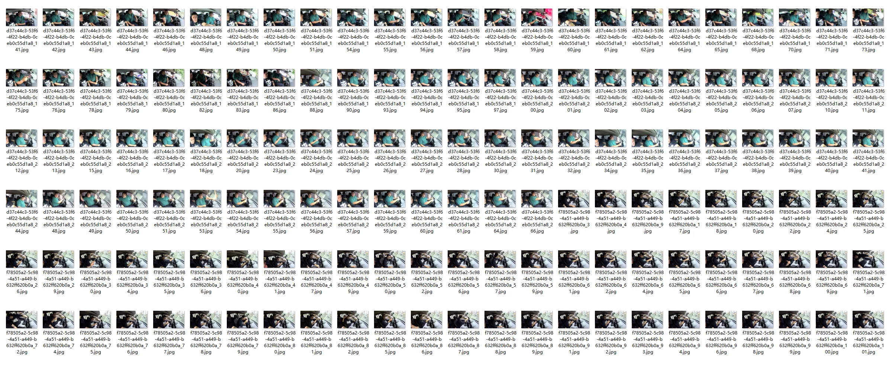
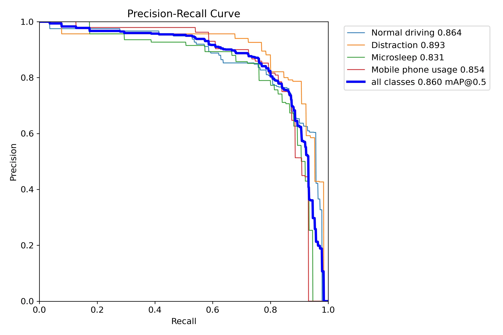
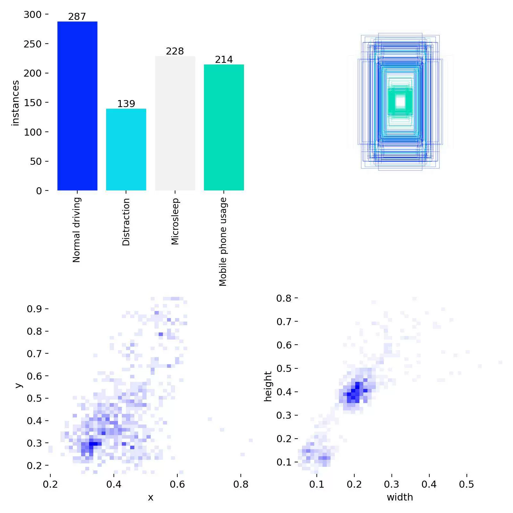
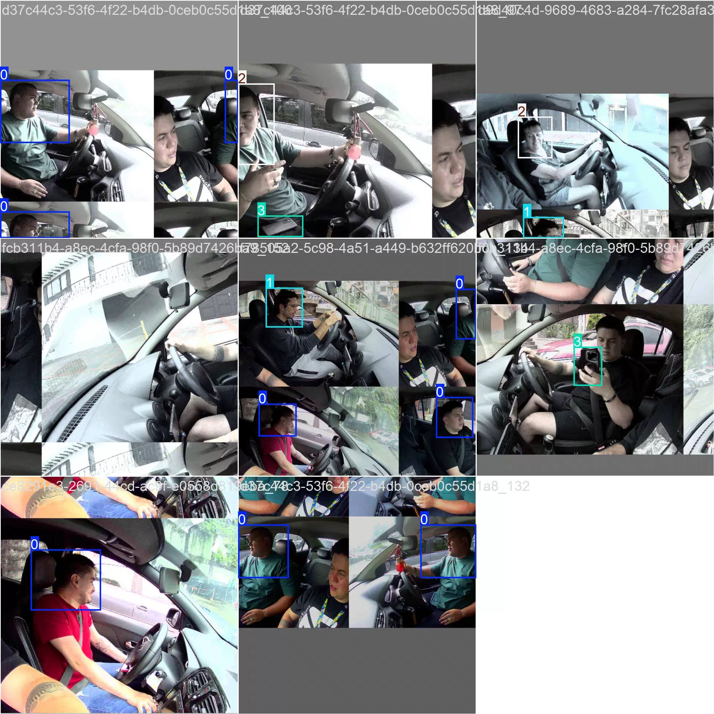
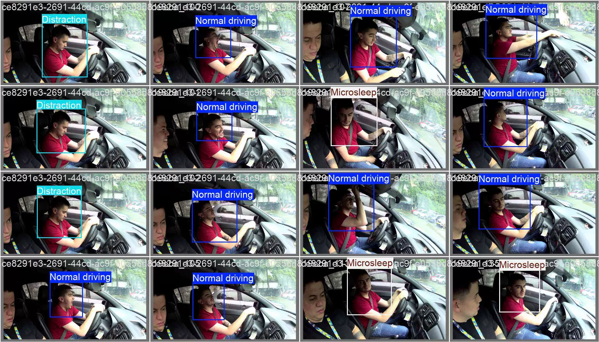

## Body

Real-world driving environment driver behavior state detection dataset in YOLO format

Totally 1232 images, all labeled and divided into training set, test set, validation set.

Training set: 784 images
Test set: 112 images
Validation set: 336 images
Resolution: 1920×1080 pixels

Divided into 4 categories, namely: 0: Normal driving 1: Distraction 2: Microsleep 3: Mobile phone usage

Contains best.py file and training process file yolov8s basic model trained 100 rounds mAP@0.5 = 0.86

Electronic virtual products sold without return or exchange.

## Images

Here is a pay link on Stripe ( https://buy.stripe.com/3cs8yP7sY87d0vu9AB ). Please contact me lonlonago@foxmail.com after funding $89, and I will send you a complete data files , thank you!

